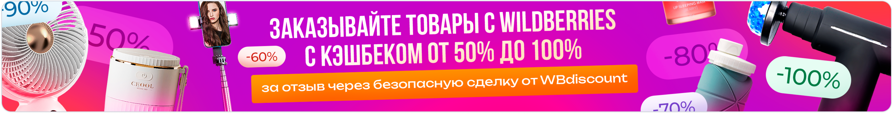

# WB Discount

Платформа для покупки товаров на Wildberries со скидкой в обмен на отзывы.



## 🚀 Технологии

- **Frontend**: Vue.js 3 (Composition API)
- **UI Kit**: Materialize Admin Template
- **HTTP Client**: Axios
- **Package Manager**: pnpm
- **Backend**: REST API

## 📦 Установка

```bash
# 1. Установите зависимости
pnpm install

# 2. Запустите dev-сервер
pnpm dev

# 3. Для production-сборки
pnpm build
```

## 🏗️ Структура проекта

```bash
src/
├── api/               # Все работы с API
│   ├── auth.js        # Методы авторизации
│   ├── products.js    # Работа с товарами
│   └── index.js       # Экспорт всех методов
├── assets/
│   ├── images/        # Изображения
│   └── styles/        # Глобальные стили
├── components/
│   ├── ui/            # UI-кит (кнопки, инпуты)
│   └── layout/        # Компоненты лэйаута
├── composables/       # Vue composables
│   ├── useApi.js      # Базовый API-клиент
│   └── useAuth.js     # Логика авторизации
├── router/            # Маршрутизация
│   └── index.js
├── stores/            # Pinia хранилища
│   ├── auth.store.js  # Хранилище авторизации
│   └── cart.store.js  # Корзина покупок
├── utils/             # Вспомогательные функции
├── views/             # Страницы
│   ├── Auth/          # Авторизация/регистрация
│   ├── Catalog/       # Каталог товаров
│   └── Dashboard/     # Личный кабинет
├── App.vue            # Корневой компонент
└── main.js            # Точка входа
```

## [Полная документация Materialize](https://demos.pixinvent.com/materialize-nextjs-admin-template/documentation/docs/guide/overview)
## [Документация для версии VueJS](https://demos.pixinvent.com/materialize-vuejs-admin-template/documentation/guide/)
